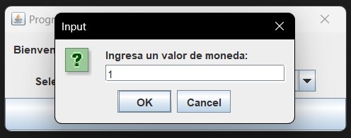

# Conversor - Proyecto Java - Alura Challenge

Este es un programa de conversión en Java que permite a los usuarios convertir entre diferentes unidades de moneda y temperatura. El programa proporciona una interfaz gráfica de usuario (GUI) intuitiva y manejo de errores para garantizar una experiencia de usuario sin problemas.

## Características Principales

### Conversor de Moneda

Con el conversor de moneda, los usuarios pueden realizar las siguientes conversiones:

- Convertir de MXN a Dólar
- Convertir de MXN a Euros
- Convertir de MXN a Libras Esterlinas
- Convertir de MXN a Yen Japonés
- Convertir de MXN a Won surcoreano
- Convertir de Dólar a MXN
- Convertir de Euros a MXN
- Convertir de Libras Esterlinas a MXN
- Convertir de Yen Japonés a MXN
- Convertir de Won surcoreano a MXN

### Conversor de Temperatura

Con el conversor de temperatura, los usuarios pueden realizar las siguientes conversiones:

- Convertir de Celsius a Fahrenheit
- Convertir de Celsius a Kelvin
- Convertir de Fahrenheit a Celsius
- Convertir de Fahrenheit a Kelvin
- Convertir de Kelvin a Celsius
- Convertir de Kelvin a Fahrenheit

## Cómo Usar

1. Ejecute el programa Java.
2. Se abrirá una ventana de interfaz de usuario.
3. Seleccione el tipo de conversión que desea realizar a través del menú desplegable.
4. Ingrese el valor que desea convertir y haga clic en "Seleccionar".
5. El programa mostrará el resultado de la conversión y le dará la opción de continuar con otra conversión o cerrar el programa.

## Requisitos

- Java 8 o superior.

## Capturas de funcionamiento

 Captura de inicio

        Menú opciones conversor

        Ejemplo conversor moneda

        Menú conversor de moneda

        Resultado ejemplo conversor moneda

        Captura de mensaje en portapapeles

        Consulta continuidad de ejecución

        Ejemplo ejecucion conversor temperatura

        Menú conversor de temperatura

        Resultado ejemplo conversor temperatura

        Manejo de errores

        Finalización de ejecución

## Herramientas

# 

## Limitaciones

Este programa solo funciona con conversiones basadas en pesos mexicanos.

## Créditos

Este programa fue desarrollado por Meredith Moreno durante el proyecto Alura Latam One Challenge, turma 5. 

10/08/2023

#challengeonecodificador5

